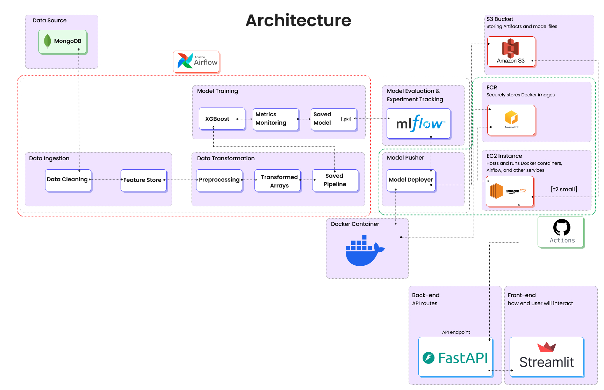
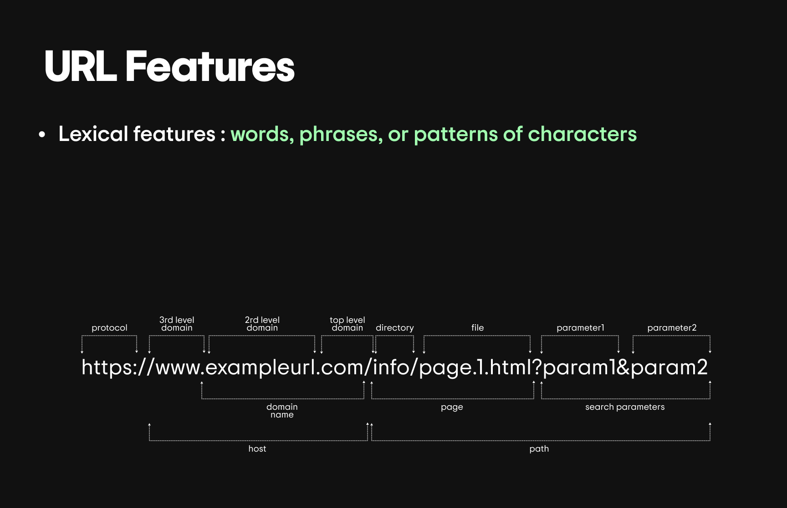
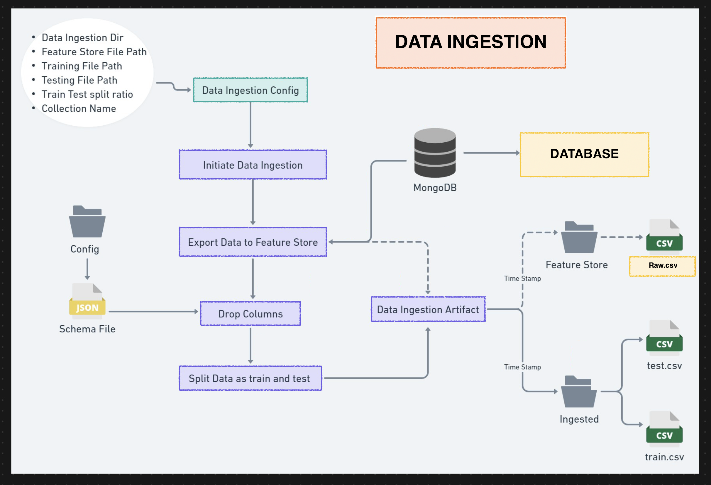
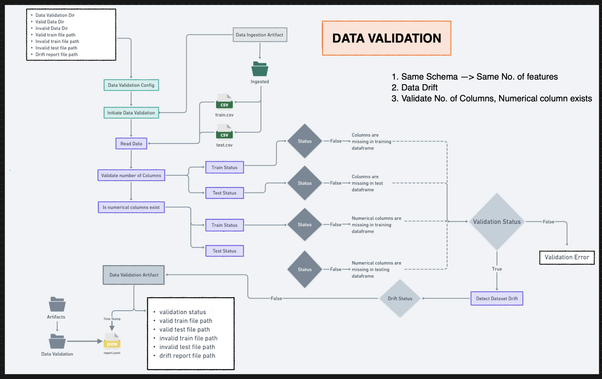
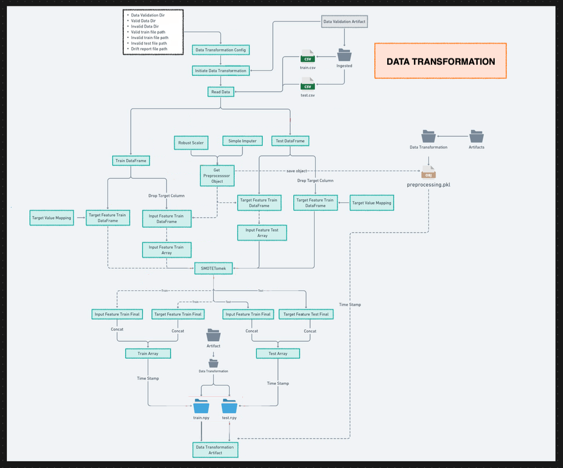
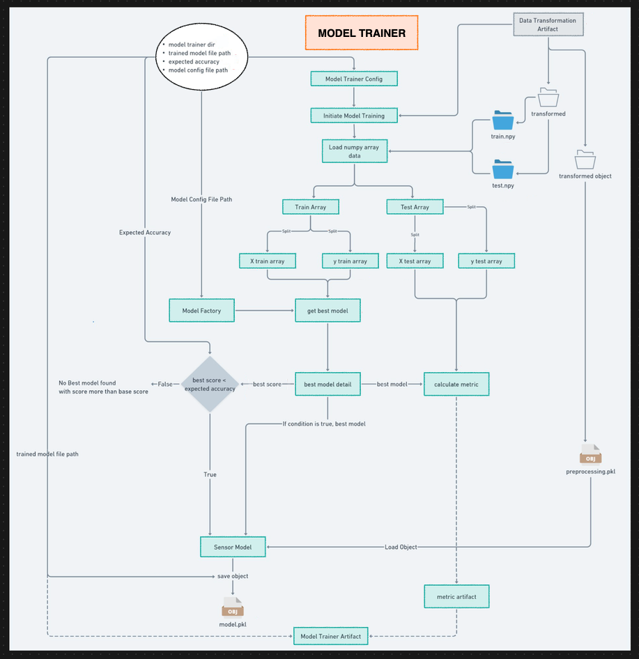

# Phishing URL Detection — End-to-End MLOps Pipeline

An automated machine learning system that classifies URLs as phishing or legitimate. The project covers the complete ML lifecycle — pulling raw data from MongoDB, validating and transforming it, training and tracking models, and serving predictions through a REST API — with the deployment containerized for cloud hosting.

## Table of Contents
1. [Overview](#overview)
2. [Features](#features)
3. [Tech Stack](#tech-stack)
4. [Dataset & Features](#dataset)
5. [Pipeline Stages](#pipeline)
6. [Deployment](#deployment)
7. [Setup & Usage](#setup)
8. [Project Structure](#structure)

---

## <a id="overview"></a>Overview

The goal of this project is to build a maintainable, production-style pipeline for detecting malicious/phishing websites from their URL characteristics. Rather than a one-off notebook, it's structured as independent pipeline components (ingestion, validation, transformation, training) that plug into each other, with experiment tracking, schema validation, and drift detection built in. The trained model is exposed through a FastAPI service that supports both retraining and real-time prediction.

**Architecture**


---

## <a id="features"></a>Features

- **Component-based pipeline** — ingestion, validation, transformation, and training are separated into independent, reusable modules.
- **Data drift detection** — schema checks plus a Kolmogorov-Smirnov test to catch distribution shifts between train/test data.
- **Experiment tracking** — model runs, hyperparameters, and metrics (F1, precision, recall) are logged via MLflow.
- **Automated artifact sync** — trained models, preprocessors, and reports are pushed to cloud storage after every run.
- **REST API** — FastAPI app with `/train` and `/predict` endpoints for on-demand retraining and inference.
- **Containerized deployment** — packaged with Docker for consistent, portable deployment.

---

## <a id="tech-stack"></a>Tech Stack

| Category | Tools |
| :--- | :--- |
| API layer | FastAPI, Uvicorn |
| ML / Data | Scikit-learn, Pandas, NumPy |
| Data store | MongoDB |
| Experiment tracking | MLflow |
| Containerization | Docker |
| Cloud storage | AWS S3 |
| Cloud hosting | AWS EC2 |

---

## <a id="dataset"></a>Dataset & Features

The model consumes URL records described by 31 lexical and network-derived features — properties of the URL string itself, its domain, and page-level signals — used together to flag likely phishing patterns.



**A few of the key features:**

| Feature | What it captures |
| :--- | :--- |
| `having_IP_Address` | Whether the URL uses a raw IP instead of a domain name |
| `URL_Length` | Overall URL length (longer URLs are more often suspicious) |
| `Shortining_Service` | Whether a URL shortener (e.g. bit.ly) was used |
| `having_At_Symbol` | Presence of "@", which can mask the real destination domain |
| `SSLfinal_State` | Validity/trustworthiness of the SSL certificate |
| `Domain_registeration_length` | How long the domain has been registered |
| `web_traffic` | Site traffic rank as a proxy for legitimacy |

---

## <a id="pipeline"></a>Pipeline Stages


**1. Data Ingestion** — pulls raw records from MongoDB, splits into train/test sets, and stores them as artifacts.


**2. Data Validation** — checks the incoming data against `data_schema/schema.yaml` (column count, types) and runs a statistical drift check between datasets.


**3. Data Transformation** — imputes missing values with a `KNNImputer` and applies a preprocessing pipeline, saving outputs as NumPy arrays ready for training.


**4. Model Training** — trains several candidate models with `GridSearchCV`, logs every run to MLflow, and persists the best-performing model + preprocessor.


**5. Artifact Sync** — datasets, validation reports, and trained artifacts are synced to an S3 bucket for persistence.

---

## <a id="deployment"></a>Deployment

The app is containerized with Docker and intended to be deployed to a cloud VM (e.g. AWS EC2), with the FastAPI service exposed on port 8080. Model/preprocessor artifacts are pulled from S3 at startup so the container itself stays lightweight.

---

## <a id="setup"></a>Setup & Usage

### Prerequisites
- Python 3.8+
- A MongoDB cluster (e.g. free-tier Atlas)
- AWS credentials configured (if using S3 sync / EC2 deployment)

### 1. Get the code
```bash
git clone <your-repo-url>
cd <your-repo-folder>
```

### 2. Install dependencies

**Using `uv` (recommended):**
```bash
curl -LsSf https://astral.sh/uv/install.sh | sh   # macOS/Linux
uv sync
```

**Using standard `venv` + `pip`:**
```bash
python -m venv venv
source venv/bin/activate   # Windows: venv\Scripts\activate
pip install -r requirements.txt
```

### 3. Configure environment variables
Create a `.env` file in the project root:
```env
MONGO_DB_USERNAME="your-mongodb-username"
MONGO_DB_PASSWORD="your-mongodb-password"
```

### 4. Load data into MongoDB
```bash
python push_data.py
```

### 5. Run it

**Train the pipeline:**
```bash
python test.py
```

**Start the API:**
```bash
uvicorn app:app --host 0.0.0.0 --port 8080
```
Interactive docs available at `http://localhost:8080/docs`.

---

## <a id="structure"></a>Project Structure

```
.
├── images/                       # Diagrams referenced in this README
├── network_security/             # Core pipeline source code
│   ├── components/                # Ingestion, validation, transformation, training
│   ├── pipeline/                  # Orchestration logic
│   ├── entity/                    # Config & artifact dataclasses
│   ├── constant/                  # Shared constants
│   ├── cloud/                     # S3 sync utilities
│   ├── exception/                 # Custom exception handling
│   ├── logging/                   # Logging setup
│   └── utils/                     # Shared helper functions
├── data_schema/schema.yaml       # Schema used for data validation
├── app.py                        # FastAPI entry point
├── Dockerfile                    # Container build config
└── requirements.txt              # Python dependencies
```
